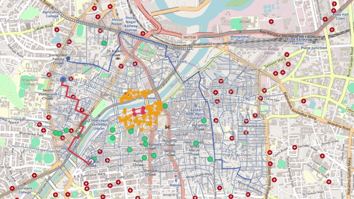
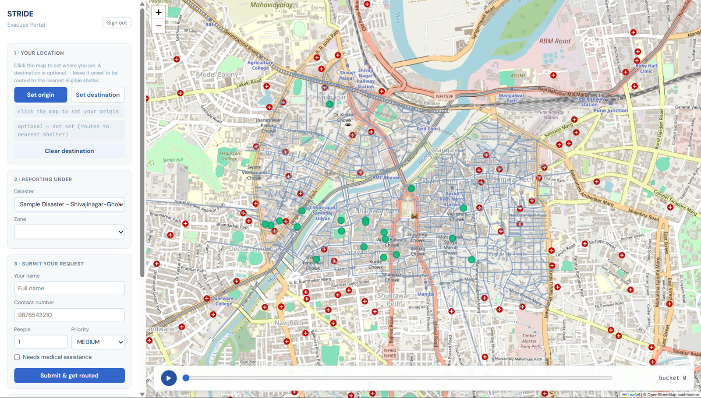
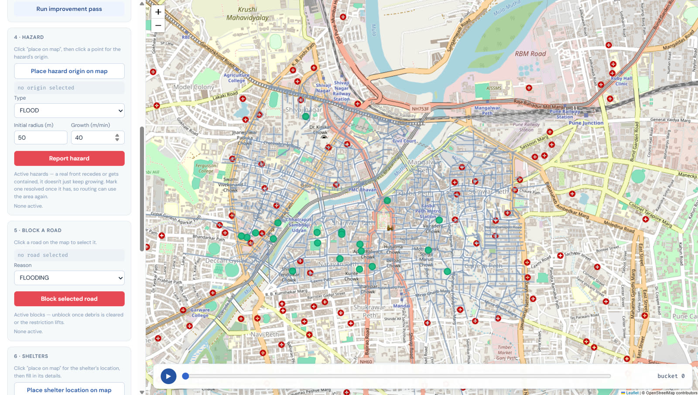
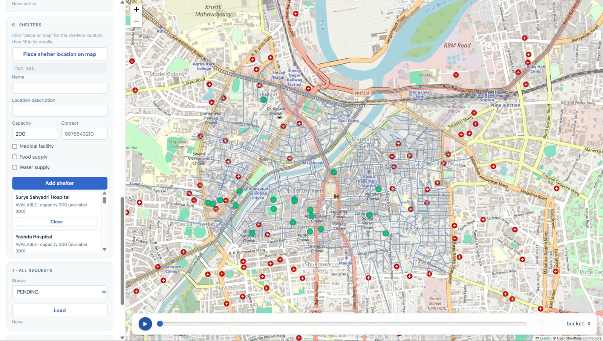
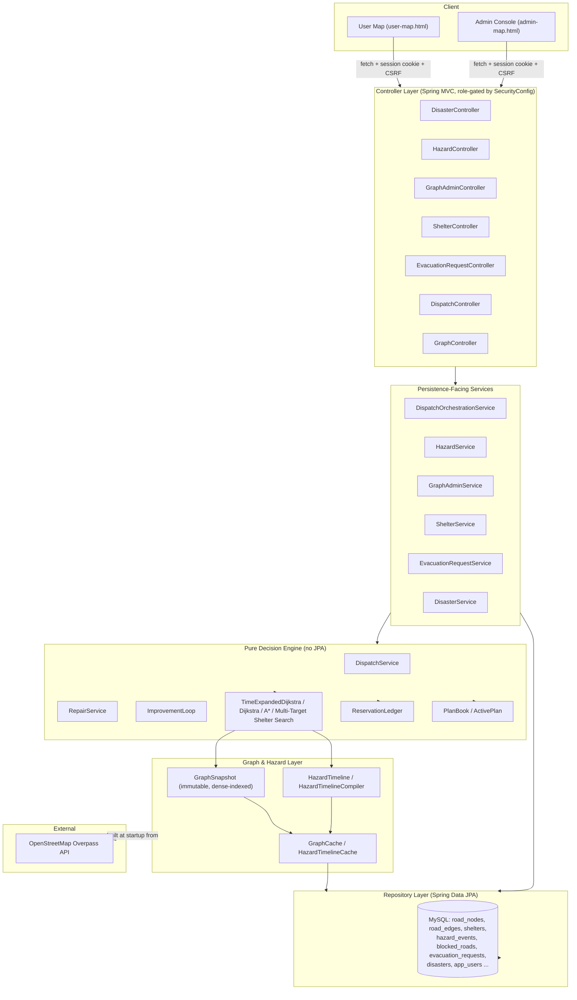

# STRIDE — Space-Time Reservation & Incremental Dispatch Engine

A Java/Spring Boot backend that plans, and continuously replans, how to move real neighborhoods of people out of a disaster area — treating every road and junction as a shared, time-limited resource instead of routing each person as if they were alone on the map. 
LIVE DEMO : https://stride-evacuation-demo.onrender.com




<sub>The admin console dispatching real routes across the Shivajinagar–Ghole Road ward, imported live from OpenStreetMap.</sub>

The name describes the architecture rather than decorating it. **Space-Time Reservation** is the shared ledger that records which road segment and junction is promised to whom in every 15-second bucket, so routes are checked against what the network can actually carry. **Incremental Dispatch** is the discipline of repairing only the platoons a disruption genuinely affects, instead of recomputing the whole plan every time a road closes or a hazard spreads. Both are explained in [Innovation / Novel Approach](#innovation--novel-approach).

---

## Table of Contents

- [Project Overview](#project-overview)
  - [Screenshots](#screenshots)
- [The Problem](#the-problem)
- [The Solution](#the-solution)
- [Key Features](#key-features)
- [Innovation / Novel Approach](#innovation--novel-approach)
- [System Workflow](#system-workflow)
- [Algorithms and Decision Logic](#algorithms-and-decision-logic)
- [Simulation Demonstration](#simulation-demonstration)
- [System Architecture](#system-architecture)
- [Technology Stack](#technology-stack)
- [Project Structure](#project-structure)
- [Prerequisites](#prerequisites)
- [Installation and Setup](#installation-and-setup)
- [Configuration](#configuration)
- [How to Use the System](#how-to-use-the-system)
- [API Documentation](#api-documentation)
- [Example Scenario](#example-scenario)
- [Testing](#testing)
- [Current Implementation Status](#current-implementation-status)
- [Limitations](#limitations)
- [Future Enhancements](#future-enhancements)
- [Contributing](#contributing)
- [License](#license)
- [Author](#author)

---

## Project Overview

STRIDE is a disaster evacuation decision engine: a backend system that decides **who should leave, by which road, in which group, at what time, and to which shelter** during a disaster — and keeps that plan honest as roads close and hazards spread.

It is built around one real ward of Pune, India (**Shivajinagar–Ghole Road**), whose road network is imported directly from OpenStreetMap rather than invented. On top of that real network sits a routing engine that reasons about *time* as well as *space*: a road is not just "open" or "blocked", it has a capacity per minute, and a plan that sends more people down it than it can hold in that minute is treated as infeasible, exactly like a plan that tries to cross a blocked road.

The system is for two kinds of user, both modelled as real accounts with real permissions:

- An **admin / emergency operator**, who declares hazards and road closures, watches the live evacuation map, and triggers batch dispatch and plan-improvement passes.
- A **citizen / user**, who submits their own evacuation request and can ask to be routed individually, watching their own assigned route on a map.

The output, in both cases, is a concrete, minute-by-minute walking/vehicle plan: which road segments to use, when to depart, when to wait, and which shelter to arrive at — not just "the shortest path to the nearest shelter."

### Screenshots

<table>
<tr>
<td width="50%">

**Login — role-based entry point**


Session-cookie authentication in front of both consoles; a successful sign-in routes an admin to the admin console and a citizen to the evacuee portal.

</td>
<td width="50%">

**Evacuee portal — self-service request**


A citizen sets their location (and, optionally, a destination) directly on the real ward road network, then submits a request for routing.

</td>
</tr>
<tr>
<td width="50%">

**Admin console — hazards and road blocks**


An operator places a hazard's origin and growth rate, or blocks a specific road segment — both feed directly into the next dispatch or repair pass.

</td>
<td width="50%">

**Admin console — shelter inventory**


The full shelter inventory with live availability, plus the pending-request queue a dispatch pass will consume next.

</td>
</tr>
</table>

## The Problem

Routing one person away from danger is a solved problem: run Dijkstra or A* from their location to the nearest open shelter. Routing a **neighborhood** is not, because:

- **Roads have capacity.** A residential street segment in this ward's real OSM data carries a median of about 2,700 persons/hour — nowhere near what "send everyone down the shortest path" implies. If a thousand people are each independently told "go this way," the road cannot physically carry them at once.
- **Shelters have capacity.** Independently routing everyone to their own "nearest shelter" produces massive oversubscription: many people are told to go to the same building, which quietly cannot hold them all.
- **Hazards move.** A flood or fire front expands over time. A route that is safe now may not be safe in ten minutes, and a plan computed once and never revisited will walk people into it.
- **The world changes mid-evacuation.** A road can be reported blocked, or a shelter closed, after people have already been told to head toward it. A useful system has to react to that without discarding and recomputing everything from scratch.

Classical shortest-path routing (plain Dijkstra/A*, as used by consumer navigation apps) answers "what is the fastest path for me," which is individually correct and collectively fictional the moment more than one party asks it at once. That is the exact failure mode this project targets, and its A/B comparison tooling (see [Simulation Demonstration](#simulation-demonstration)) measures it directly rather than asserting it.

## The Solution

**What enters the system:** evacuation requests (a location, a group size, a priority, optional medical-assistance need, and optionally a specific destination), hazard reports (an expanding danger zone with an origin, a starting radius, and a growth rate), and road-block reports.

**How it is processed:**

1. The real road network for the ward is imported once from OpenStreetMap and held in memory as an immutable, densely-indexed graph.
2. Every hazard and road block is compiled into a **hazard timeline** — for every road segment and junction, a table of when it becomes risky and when it becomes lethal, out to a 40-minute rolling horizon.
3. Every request becomes a **party** that needs to travel from its origin to a shelter (or a chosen destination).
4. Large parties are split into **platoons** (waves of at most a configured size) so that "500 people" is represented honestly as a flow spread over several minutes, not as 500 people occupying one road cell simultaneously.
5. Platoons are routed one at a time, in a deliberate priority order, against a shared **reservation ledger** that tracks exactly how much of every road segment's and junction's capacity is already promised to someone else at every point in time. A later platoon's search sees the earlier platoons' reservations and is forced onto a different road, a later departure, or a different shelter if the first choice is already full.
6. When a road is reported blocked or a hazard newly makes a cell lethal, the system finds only the platoons whose still-future route touches that cell and **replans just those platoons** from wherever they actually are right now — not the whole plan.
7. An optional **anytime improvement pass** revisits already-committed platoons after the first-come dispatch order and looks for a strictly better overall plan, using any leftover compute budget.

**What decisions/outputs are generated:** for each party, a concrete route (a sequence of road segments and waiting periods, with real timestamps derived from the bucket index), the shelter or destination it will reach, and — if the network genuinely cannot carry everyone — an honest shortfall figure rather than a silently wrong route.

**In simple terms:** instead of asking "what's the fastest way for this one person to safety," the engine asks "given everyone who has already been told to move, and everyone still waiting, what is the fastest way for *this* person to safety that the road can actually deliver" — and it keeps re-asking that question as the disaster and the road network change.

## Key Features

All features below are implemented and exercised by the project's automated test suite unless explicitly marked otherwise.

- **Real-network import** — imports the actual Shivajinagar–Ghole Road ward road graph from OpenStreetMap via the Overpass API (with an on-disk cache for offline/deterministic reruns), including estimated per-road-class capacity and per-amenity-type shelter capacity ([`OsmImportService`](src/main/java/com/evacuation/engine/osm/OsmImportService.java)).
- **Time-expanded, capacity-aware routing** — the core search (`TimeExpandedDijkstra`) finds the cheapest route through space *and* time, refusing any road or junction cell that is already full or that a hazard has made lethal.
- **Sequential capacity-respecting dispatch** — parties are routed one at a time against a shared reservation ledger, so a batch of requests produces a plan that is collectively deliverable, not just individually optimal (`DispatchService`).
- **Priority with anti-starvation elevation** — dispatch order is driven by request priority (LOW/MEDIUM/HIGH/CRITICAL), but a party's effective priority also rises the longer it waits, so a low-priority party cannot be perpetually skipped (`DispatchService.orderForDispatch`).
- **Wave-splitting ("platoons")** — a group larger than the configured platoon size is automatically split into staggered waves rather than modelled as one instantaneous mass movement.
- **Expanding-circle hazard modelling** — a hazard is an origin point, an initial radius, and a growth rate; the compiler turns that into per-cell SAFE → RISKY → LETHAL onset times, including a configurable leading "risk buffer" band (`HazardTimelineCompiler`).
- **Risk-priced routing, not just risk-avoiding** — cells inside the RISKY buffer are not forbidden, they are priced, so the search can accept a longer but safer route when the exposure cost justifies it.
- **Incremental repair, not full replanning** — when a road is newly blocked or a hazard newly turns a cell lethal, only the platoons whose future route actually intersects that cell are replanned, from their real current position (`RepairService`).
- **Anytime plan improvement (large neighborhood search)** — after the initial greedy dispatch, an optional pass repeatedly re-plans the single worst-off committed platoon and keeps the change only if it provably improves the whole plan under a fixed objective (`ImprovementLoop`).
- **A lexicographic, four-level plan objective** — people placed, then weighted person-minutes, then makespan, then a safety-margin proxy — used consistently to compare any two candidate plans (`LexicographicObjective`).
- **Role-gated REST API and live map UI** — a Spring Security–backed split between an ADMIN console (`admin-map.html`) and a USER map (`user-map.html`), each backed by session-cookie authentication with CSRF protection.
- **A/B measurement harness** — a reproducible comparison of capacity-blind independent routing against the engine's own greedy and greedy+LNS strategies, using identical demand and identical hazards (`Simulator`, `IndependentDijkstraStrategy`, `SimulationMetrics`).
- **Perturbation replay tooling** — programmatic scenarios for "a hazard arrives earlier than forecast," "a shelter closes mid-evacuation," and "one platoon moves slower than planned," each measuring repair latency and how much of the plan actually changed (`PerturbationScenarios`).
- **An external optimality-gap oracle** — a standalone Python min-cost-flow solver (`tools/oracle`) that computes the *provably optimal* answer on small hand-built instances and reports how far the engine's own greedy algorithm falls short, with the gap asserted, not eyeballed.

Planned/not-yet-implemented items are listed separately in [Current Implementation Status](#current-implementation-status) and [Limitations](#limitations) — nothing above is aspirational.

## Innovation / Novel Approach

### The Core Idea

Most evacuation-routing demos — and this project's own [earlier README](#) before this rewrite — stop at "shortest path from A to B." The idea this project actually implements is: **treat the road network as a shared space-time resource with a ledger, not a static map**, and treat one already-committed plan as something that gets *repaired* when the world changes, not thrown away and recomputed.

In plain terms: instead of a GPS app that tells everyone the same "best route" and hopes it works out, the engine keeps a live, shared "who's using which road when" book. Every new request checks that book before being told a route, and every disruption only touches the pages of the book it actually affects.

### How It Works

1. **Space becomes space-time.** Every road segment and junction is expanded, conceptually, across a rolling 40-minute horizon divided into 15-second buckets. A "state" isn't just a location — it's a location *at a specific bucket*.
2. **A single search answers both "where" and "when."** `TimeExpandedDijkstra` runs one Dijkstra pass over this virtual graph (never materialized in memory — arcs are generated on the fly from the static road graph), and because every arc cost is non-negative and time always moves forward, Dijkstra's optimality guarantee carries over exactly.
3. **A reservation ledger turns individually-correct answers into collectively-true ones.** `ReservationLedger` tracks, per road segment and per bucket, how many people are already promised that cell. Every later party's search consults it, so a full cell reads as genuinely infeasible — the search is forced onto a different road, a later departure, or a different shelter.
4. **Large groups become flows, not teleporting crowds.** A party above the configured platoon size is split into waves with a departure stagger, so "500 people" occupies road capacity the way 500 real people actually would: spread over several minutes.
5. **Repair is surgical.** When an event compromises a cell, `RepairService` finds only the platoons whose *still-future* reservation touches it (`ReservationLedger.platoonsIntersecting`), gives back only their future holdings (their already-elapsed history is left untouched), and replans each from its real current position — never from its original origin, and never the whole plan.
6. **Spare compute is spent looking for a better plan, safely.** `ImprovementLoop` implements an anytime large-neighborhood search: pick the most "regretful" committed platoon (the one whose committed cost most exceeds its own free-flow bound), tear it up, re-plan it against everyone else's untouched reservations, and keep the change only if the whole plan's score — evaluated lexicographically — provably improves. A rejected move is rolled back before the next iteration, so the loop can be interrupted at any point without corrupting the plan.

### Why It Is Different

A conventional evacuation-routing demo computes shortest paths independently per person and stops there. This project's central claim — and the reason `IndependentDijkstraStrategy` exists as a first-class, deliberately-preserved baseline rather than being deleted once STRIDE worked — is that independent shortest-path routing is not merely suboptimal but **actively wrong** once more than one party is involved: it promises the same road capacity to everyone who asks, and is silent about shelters filling up. The engine's contribution is the capacity ledger and the incremental-repair discipline built around it, not the underlying shortest-path algorithm, which is intentionally plain Dijkstra.

### Technical Perspective

The architecture keeps the *pure* planning engine (`dispatch/`, `algorithm/`) free of any JPA or persistence dependency — it operates entirely on `Party`, `GraphSnapshot`, and `InstructionSet`, dense-indexed primitive arrays, and no lazy-loaded entities. `DispatchOrchestrationService` is the only place where the persisted world (`EvacuationRequest` rows, database ids) is translated into and out of that pure model. This means the exact same engine code that serves the live REST API is also what the A/B harness (`sim/`) and the Python oracle's Java-faithful "greedy port" are measured against — there is one algorithm, not a demo version and a real version.

The hazard model is a genuine three-state system (`SAFE` / `RISKY` / `LETHAL`), not a boolean. `RISKY` cells are priced into the search's cost function via an exposure weight (`graph.dispatch.exposure-weight`), so the engine can trade a longer route for a safer one continuously, rather than only ever choosing between "allowed" and "forbidden."

### Benefits

- A dispatch pass produces routes the network can **actually carry simultaneously**, verified by the same capacity ledger every route was checked against.
- Reacting to a new hazard or a road closure costs work proportional to how many platoons are actually affected, not to the size of the whole plan.
- The plan-quality objective is a single, explicit, four-level lexicographic function (`LexicographicObjective`) applied consistently everywhere a "is this plan better" question is asked — in the improvement loop and in the A/B harness alike — so "better" always means the same thing.
- The Python oracle keeps the "STRIDE is a greedy heuristic, not globally optimal" disclosure honest: it is an assertion backed by a measured optimality gap on concrete instances, not a claim taken on faith.

### Innovation Comparison

| Conventional Approach | This Project's Approach | Expected Benefit |
|---|---|---|
| Each request routed independently, shortest path only | Requests routed sequentially against a shared space-time reservation ledger | Routes the network can actually deliver simultaneously, not just individually valid promises |
| Roads treated as binary open/closed | Roads and junctions carry per-bucket capacity; occupancy is tracked and enforced | Prevents overloading a road even when it is technically "open" |
| Hazards treated as static blocked/unblocked zones | Hazards are expanding-circle fronts compiled into per-cell SAFE/RISKY/LETHAL onset times | Routes can react to a hazard *before* it arrives, and can accept calculated risk instead of only binary avoidance |
| A disruption triggers a full replan of every route | Only platoons whose still-future route intersects the compromised cells are replanned, from their real current position | Repair cost scales with what actually changed, and already-elapsed history is never rewritten |
| A single computed plan is treated as final | An anytime local-search pass keeps spending any available compute to find a lexicographically better plan, with every rejected move rolled back | Plan quality improves with available time without ever risking a worse committed plan |
| Heuristic quality asserted, not measured | A standalone min-cost-flow oracle computes the true optimum on hand-built instances and asserts the measured gap | The "greedy, not globally optimal" disclosure is a checked number, not a claim |

## System Workflow

> The system follows these major stages: **graph import → request/hazard intake → hazard-timeline compilation → dispatch (space-time search + reservation) → incremental repair on disruption → anytime improvement → result presentation.**

1. **Graph import (startup, or on demand).**
   - *Input:* the configured ward's OpenStreetMap data (`graph.osm.*` properties), fetched from Overpass or read from the on-disk cache.
   - *Processing:* `OsmImportService`/`GraphBuilder` parse ways and nodes, split ways at intersections, estimate speed and capacity per road class, extract shelters from tagged amenities (school/hospital/community_centre), and persist `RoadNode`/`RoadEdge`/`Shelter` rows.
   - *Component:* `GraphStartupRunner` orchestrates this on boot; `GraphCache` then builds an immutable, densely-indexed `GraphSnapshot` (a CSR-style adjacency structure) from the database.
   - *Output:* an in-memory graph every routing algorithm addresses by dense integer index, never by database id, for cache-friendly, allocation-light searches.

2. **Request and hazard intake (continuous).**
   - *Input:* `POST /api/evacuation-requests` (a citizen's request), `POST /api/hazards` (a predicted hazard front), `POST /api/graph/blocked-roads` (a reported closure).
   - *Processing:* each is validated (coordinates must fall inside a Pune bounding box, time ranges must be coherent) and persisted as `PENDING`/active.
   - *Component:* `EvacuationRequestService`, `HazardService`, `GraphAdminService`.
   - *Output:* rows ready to be picked up by the next dispatch or timeline compile.

3. **Hazard-timeline compilation.**
   - *Input:* the current `GraphSnapshot`, active `BlockedRoad` rows, active `HazardEvent` rows.
   - *Processing:* `HazardTimelineCompiler` writes, per road-segment slot and per junction, a `SAFE`/`RISKY`/`LETHAL` state for every 15-second bucket out to the horizon (160 buckets = 40 minutes by default), using an "upgrade-only" rule (severity never decreases once written) so passes can run in any order.
   - *Component:* `HazardTimelineCache` holds the compiled result, versioned against the graph it was built from.
   - *Output:* a `HazardTimeline` the routing search consults on every candidate move.

4. **Dispatch — the space-time search and reservation.**
   - *Input:* every currently-`PENDING` evacuation request (or, for a self-service call, exactly one).
   - *Processing:* requests become `Party` objects; each is split into `Platoon` waves; parties are ordered by effective priority (nominal priority plus a wait-time bonus) and then by how constrained their options are; each platoon in turn runs `TimeExpandedDijkstra` against the shared `ReservationLedger`, and a successful search immediately reserves the cells it used before the next platoon is planned.
   - *Component:* `DispatchService`.
   - *Output:* an `InstructionSet` — every platoon successfully committed, plus an honest list of shortfalls for anyone the network could not currently place.

5. **Incremental repair, on disruption.**
   - *Input:* the set of road-segment slots and/or junctions a new hazard or road block has just compromised.
   - *Processing:* `ReservationLedger.platoonsIntersecting` finds every platoon whose still-future reservation touches one of those cells; each is anchored at its real projected position right now, its future reservations are released (its past stays untouched), and it is re-searched from that anchor.
   - *Component:* `RepairService`.
   - *Output:* an `InstructionSet` scoped to exactly what changed — replanned platoons and any newly stranded ones.

6. **Anytime improvement (optional, on demand).**
   - *Input:* the current session's whole committed plan and an iteration budget.
   - *Processing:* `ImprovementLoop` repeatedly picks the platoon with the largest "regret" (its committed cost minus its own free-flow lower bound), tentatively re-plans it, and keeps the change only if the whole plan's `LexicographicObjective.Score` provably improves; otherwise it rolls the ledger back to exactly its prior state.
   - *Component:* `ImprovementLoop`, `LexicographicObjective`.
   - *Output:* a `Result` (iterations run, iterations accepted, the plan's final score) and, if any moves were accepted, an improved standing plan.

7. **Result presentation.**
   - *Input:* the standing plan (from step 4 or 6) or a single request's outcome.
   - *Processing:* `DispatchOrchestrationService` resolves dense indices back into real coordinates and shelter identities, assembling a per-platoon list of waypoints with real bucket-derived timing.
   - *Component:* `DispatchController` / `EvacuationRequestController` (JSON), consumed live by `admin-map.js` / `user-map.js` and rendered on a Leaflet map.
   - *Output:* a route an admin or citizen can see on the map — the road segments to take, when to wait, and where they end up.

## Algorithms and Decision Logic

### Time-Expanded Dijkstra (space-time shortest path)

#### Purpose
Finds the cheapest way for one platoon to reach an eligible shelter (or a specific chosen destination), honoring road/junction capacity and predicted hazards simultaneously — the single search every dispatch, repair, and improvement operation is built on.

#### Why This Algorithm Was Chosen
The problem is naturally a shortest-path problem once "when" is folded into the notion of a graph *state*: a state is `(node, time bucket)`, not just `node`. Every generated arc — a movement, a wait, or a shelter "sink" arc — carries a fixed, non-negative cost decided at the moment it is generated, and every real arc strictly advances the time bucket, so the state graph is a DAG with non-negative edge weights. Under those two properties, plain Dijkstra's optimality proof applies without modification — no need for a more general (and slower) algorithm.

#### Inputs
- The static road graph (`GraphSnapshot`) and the compiled `HazardTimeline`, combined into a `TraversalPolicy`.
- An origin node and departure bucket.
- A `Destination` — either "any eligible shelter" (a shelter-eligibility predicate plus a medical-preference flag) or one fixed target node.
- The current `ReservationLedger`, consulted read-only.
- The platoon's size, checked against the ledger's residual capacity on every candidate move.

#### Processing Logic
1. Treat the search as a virtual, never-materialized time-expanded graph; a settled state `(v, b)` generates its outgoing arcs on the fly from `v`'s row in the static graph.
2. At each settled state, check whether it can reach a "sink": an eligible shelter at that node (priced with a penalty if the platoon prefers a medical facility and this one lacks it), or the fixed target node (cost 0).
3. Generate a **wait arc** to `(v, b+1)` if the node stays non-lethal and the ledger has room for this platoon there.
4. Generate **movement arcs** to `(u, b+τ)` for every real road segment leaving `v`, but only if: the arc and its destination stay non-lethal through a configured safety margin *after* the platoon would clear it (`hazardFeasible`), and the ledger confirms room for this platoon's size across the whole occupied window (`edgeFeasible`).
5. Price each movement arc as its real travel time plus an exposure surcharge for every bucket it spends in a `RISKY` cell.
6. Stop as soon as the priority queue's head cost is no better than the best sink found so far — every arc cost is non-negative, so nothing still queued can improve on it.

#### Output
A `SearchResult`: the cheapest feasible walk (a sequence of movement/wait steps with real timing), which shelter (if any) it reaches, or an explicit infeasible result if nothing satisfies capacity and hazard constraints within the horizon.

#### Role in the Overall Workflow
This is the one routing primitive every higher-level piece calls: `DispatchService` (first placement), `RepairService` (replanning after a disruption), and `ImprovementLoop` (re-planning a regretful platoon) all invoke it directly.

#### Example
A platoon of 6 people at a junction needs to reach a shelter 3 buckets away by the direct road. If that road segment already has 5 other people reserved in the departure bucket and its capacity per bucket is 9, the search accepts the move (5 + 6 = 11 > 9 would actually reject it — in this example it would instead try waiting a bucket, or taking a longer but uncontested road).

#### Complexity
Equivalent to Dijkstra over the virtual state space: `O((N·T) log(N·T))` in the worst case, where `N` is node count and `T` is the horizon in buckets, since each state is settled once and every settle can push a small constant number of outgoing arcs (movement arcs are generated straight from the CSR row).

#### Implementation Reference
[`TimeExpandedDijkstra.java`](src/main/java/com/evacuation/engine/algorithm/spacetime/TimeExpandedDijkstra.java)

---

### Plain Dijkstra and A* (free-flow, capacity-blind point queries)

#### Purpose
Answer "how far, ignoring congestion" — used as a cheap probe rather than for actual dispatch. A* is the goal-directed, faster variant used when the target is known in advance.

#### Why This Algorithm Was Chosen
Both estimate how "constrained" a party is (how far its nearest help is under ideal conditions), which drives dispatch ordering, and both serve as the free-flow lower bound the improvement loop's "regret" score is measured against. A* uses an admissible Haversine-distance-based time heuristic (`HaversineHeuristic`), so it reaches the same optimal answer as Dijkstra with far fewer expansions when the single target is known.

#### Inputs
The static graph, the instantaneous traversal policy (current hazard state, no time dimension), a source node, and — for A* — a known target node.

#### Processing Logic
Standard priority-queue Dijkstra/A* over the plain (non time-expanded) graph, honoring only the *current* hazard state (no future-time reasoning, no capacity).

#### Output
A `PathResult`: reachable or not, total free-flow travel time, and the path.

#### Role in the Overall Workflow
Used by `DispatchService.estimateConstrainedness` (dispatch ordering) and `ImprovementLoop.freeFlowBound` (the regret score's baseline) — never for producing an actual committed route, since neither considers capacity or future hazard onset.

#### Complexity
`O(E log N)` with a binary heap; A* typically explores far fewer nodes in practice due to the heuristic, with identical worst-case bound.

#### Implementation Reference
[`DijkstraShortestPath.java`](src/main/java/com/evacuation/engine/algorithm/DijkstraShortestPath.java), [`AStarShortestPath.java`](src/main/java/com/evacuation/engine/algorithm/AStarShortestPath.java), [`HaversineHeuristic.java`](src/main/java/com/evacuation/engine/algorithm/HaversineHeuristic.java)

---

### Multi-Target Shelter Search

#### Purpose
Answers "which eligible shelter can this node reach soonest?" with a single search rather than one search per candidate shelter.

#### Why This Algorithm Was Chosen
The textbook way to answer a multi-target query is a virtual zero-cost super-sink connected from every eligible target, reducing it to one shortest-path run. Since the graph is immutable and cannot be mutated to add that sink, the same effect is achieved with a stopping rule: because Dijkstra settles nodes in non-decreasing true-distance order, the *first* eligible shelter node settled is provably the nearest reachable one.

#### Inputs
The static graph, the instantaneous traversal policy, a source node, and a shelter-eligibility predicate (open status, capacity, etc. — supplied by the caller).

#### Processing Logic
Ordinary Dijkstra expansion from the source; on settling each node, check whether it hosts an eligible shelter, and if so, stop and return it immediately.

#### Output
A `ShelterPathResult`: the nearest eligible shelter's identity, the free-flow path and cost to it, or an unreachable result.

#### Role in the Overall Workflow
Used as the free-flow constrainedness probe for shelter-seeking parties in `DispatchService.orderForDispatch`, and as the free-flow bound in `ImprovementLoop.freeFlowBound` for shelter-routed platoons.

#### Complexity
`O(E log N)`, identical to plain Dijkstra, since it is the same expansion with an early-exit condition.

#### Implementation Reference
[`MultiTargetShelterSearch.java`](src/main/java/com/evacuation/engine/algorithm/MultiTargetShelterSearch.java)

---

### Sequential Capacity-Aware Dispatch

#### Purpose
Turns a batch of independent shortest-path answers into a *collectively deliverable* plan by routing platoons one at a time against a shared, mutating reservation ledger.

#### Why This Algorithm Was Chosen
A single space-time search only guarantees one platoon's route is individually feasible against whatever the ledger currently holds. Running every platoon's search in a deliberate order, each one committing its reservation before the next is searched, is what makes every later platoon's search already "see" the roads earlier platoons have filled.

#### Inputs
The batch of `Party` requests, the current `GraphSnapshot`/`TraversalPolicy`, and the session's retained `ReservationLedger`/`PlanBook`.

#### Processing Logic
1. Order parties by *effective priority* (nominal priority ordinal plus a bonus proportional to how long they have waited — anti-starvation elevation), then by *most-constrained-first* (largest free-flow cost to their best option), then by request time.
2. Split each party into platoons no larger than the configured maximum, staggering their departure buckets.
3. For each platoon in turn, run `TimeExpandedDijkstra` against the live ledger and live shelter-remaining tally; on success, reserve the walk's cells immediately (all-or-nothing) before moving to the next platoon.
4. A wave that cannot be placed stops that party's remaining waves and records a shortfall for all of them together.

#### Output
An `InstructionSet`: every platoon actually committed, and an honest per-party shortfall list.

#### Role in the Overall Workflow
The main entry point for turning pending evacuation requests into a live plan; called by `DispatchOrchestrationService` for both the admin batch endpoint and a citizen's self-service routing request.

#### Example
Twelve parties of 25 people each all want to cross the same narrow bridge (capacity 25/bucket) versus a slower, wider detour (capacity 100/bucket). Twelve *independent* searches would each report "cross the narrow bridge, it's fastest" — a fiction, since the bridge cannot hold twelve simultaneous crossings. Sequential dispatch fills the bridge's capacity first, then routes the remaining parties over the detour or onto a later bucket on the bridge.

#### Complexity
`O(P)` space-time searches, where `P` is the number of platoons (parties split into waves) — each search itself bounded as above.

#### Implementation Reference
[`DispatchService.java`](src/main/java/com/evacuation/engine/dispatch/DispatchService.java), [`ReservationLedger.java`](src/main/java/com/evacuation/engine/dispatch/ReservationLedger.java)

---

### Incremental Repair

#### Purpose
Updates only the part of a committed plan that a new disruption (hazard onset, road block) actually invalidates.

#### Why This Algorithm Was Chosen
Recomputing the entire plan on every disruption would be correct but wasteful, and would also silently discard already-in-progress movement history. Reservations are tracked per platoon, so "who does this event affect" is a direct lookup, and repair can operate on exactly that subset.

#### Inputs
The set of road-segment slots and/or junction indices a disruption has just compromised, and the current wall-clock time.

#### Processing Logic
1. Find every platoon holding a still-future reservation on an affected cell (`ReservationLedger.platoonsIntersecting`).
2. For each, in priority order: compute where it actually is right now (`PlanBook.projectedPosition`), release only its future reservations (its elapsed history is preserved), drop its old plan-book entry, and re-run `TimeExpandedDijkstra` from that real position.
3. Commit the new route, or mark the platoon stranded if nothing feasible exists from its current position.

#### Output
An `InstructionSet` scoped to exactly what changed: replanned platoons and newly stranded ones — never the untouched rest of the plan.

#### Role in the Overall Workflow
Invoked by `GraphAdminService` after a road block is persisted and the hazard timeline is recompiled; the perturbation-scenario harness exercises the same path for a hazard arriving early.

#### Complexity
Proportional to the number of affected platoons and the cost of one space-time search each — not to the size of the whole plan.

#### Implementation Reference
[`RepairService.java`](src/main/java/com/evacuation/engine/dispatch/RepairService.java)

---

### Anytime Large-Neighborhood Improvement

#### Purpose
Spends any available extra compute time trying to find a strictly better overall plan than the one greedy dispatch produced.

#### Why This Algorithm Was Chosen
Greedy sequential dispatch commits each party against the board as it stood at that party's turn; an early party may hold a corridor a later party needed more. Re-planning one already-committed platoon at a time against the otherwise-finished board is the cheapest move that can discover and correct that.

#### Inputs
The current session's committed plan and an iteration budget.

#### Processing Logic
1. Pick the platoon with the largest **regret**: its committed cost minus its own free-flow lower bound.
2. Record its current reservations (a `Journal`), release them, and re-search it against everyone else's untouched reservations.
3. Score the whole plan before and after with `LexicographicObjective`; keep the new route only if it is strictly better, otherwise roll the ledger back exactly to the journaled state.
4. Repeat up to the iteration budget; the lock is held per-iteration only, so a real dispatch or repair call can interleave between iterations.

#### Output
A `Result` (iterations run, iterations accepted, final plan score) and, for accepted iterations, an improved standing plan.

#### Role in the Overall Workflow
An optional pass triggered via `POST /api/dispatch/improve`, run after the initial dispatch to spend spare time on plan quality without risking the already-committed plan.

#### Complexity
`O(iterations)` space-time searches, each interruptible between iterations; monotone by construction (a rejected move never leaves the plan worse than before that iteration).

#### Implementation Reference
[`ImprovementLoop.java`](src/main/java/com/evacuation/engine/dispatch/ImprovementLoop.java), [`LexicographicObjective.java`](src/main/java/com/evacuation/engine/dispatch/LexicographicObjective.java)

---

### Hazard Timeline Compilation

#### Purpose
Converts a hazard's geometry (origin, initial radius, growth rate) and any active road blocks into a concrete, per-bucket SAFE/RISKY/LETHAL state for every road segment and junction — the data structure every routing search actually consults.

#### Why This Algorithm Was Chosen
Modelling a hazard as an expanding circle reduces "how far outward has this hazard's danger buffered" to a single scalar distance calculation, avoiding a full computational-geometry dependency while still supporting a genuine three-state, time-varying model (a hard binary "blocked/open" would collapse a real transition zone into a cliff).

#### Inputs
The current `GraphSnapshot`, active `BlockedRoad` rows, and active `HazardEvent` rows (origin coordinates, initial radius, growth rate, leading risk buffer, risk factor, start time).

#### Processing Logic
1. Write LETHAL across the full horizon for any statically blocked/closed/under-repair road or inactive node (the zero-behavior-change migration from the old boolean overlay).
2. For each active hazard event, compute, for every road-segment midpoint and every junction, the great-circle distance from the hazard's origin, and derive an onset bucket for RISKY (front edge minus the leading buffer) and LETHAL (the front edge itself), given the front's growth rate and elapsed time.
3. Write both onsets under an "upgrade-only" rule — a cell's severity can only increase, and a higher risk factor overwrites a lower one at the same severity — so every pass is order-independent.

#### Output
An immutable `HazardTimeline`, versioned against the graph snapshot it was compiled from.

#### Role in the Overall Workflow
Compiled once per dispatch session (and recompiled on demand after any hazard/road-block change); every space-time search reads it through a `TraversalPolicy`.

#### Complexity
`O((edges + nodes) × active hazard events)` per compile — a full geometric pass per event, which is acceptable at ward scale and is explicitly documented as a candidate for revisiting at city scale.

#### Implementation Reference
[`HazardTimelineCompiler.java`](src/main/java/com/evacuation/engine/graph/time/HazardTimelineCompiler.java)

---

## How the Algorithms Work Together

```
Evacuation requests ──┐
Hazard reports    ────┼──▶ HazardTimelineCompiler ──▶ HazardTimeline ──┐
Road block reports ───┘                                                │
                                                                        ▼
                     Party (per request) ──▶ DispatchService ──▶ TimeExpandedDijkstra
                                                   │                    ▲
                                                   ▼                    │
                                          ReservationLedger ◀───────────┘
                                                   │
                                    ┌──────────────┼───────────────────┐
                                    ▼                                  ▼
                            RepairService                     ImprovementLoop
                     (on hazard/road disruption)         (spare-compute quality pass)
                                    │                                  │
                                    └──────────────┬───────────────────┘
                                                    ▼
                                            PlanBook (standing plan)
                                                    │
                                                    ▼
                                    DispatchOrchestrationService
                                       (resolves to real coordinates)
                                                    │
                                                    ▼
                                         Admin / User map (Leaflet)
```

`TimeExpandedDijkstra` is the single routing primitive. `DispatchService` calls it once per platoon in priority order, committing each result to the `ReservationLedger` before the next call. `RepairService` and `ImprovementLoop` call the exact same search, differing only in *which* platoon they re-route and from *where* (a disruption's real current position vs. an already-committed platoon's original departure). `DijkstraShortestPath`, `AStarShortestPath`, and `MultiTargetShelterSearch` never produce a committed route themselves — they exist purely to estimate a free-flow baseline that `DispatchService`'s ordering heuristic and `ImprovementLoop`'s regret score are measured against.

## Simulation Demonstration

The demo clip at the top of this README shows the admin console dispatching live routes. This section describes what the project's built-in simulation and comparison tooling measures, and how to reproduce it yourself.

### What the Simulation Demonstrates

The project ships two distinct, runnable demonstrations, both exercised by automated tests:

1. **The A/B strategy comparison (`Simulator.runComparison`)** — one deterministic batch of synthetic demand (seeded, so it is exactly reproducible) is routed three ways against the *identical* hazard timeline: (a) `IndependentDijkstraStrategy`, the capacity-blind "route everyone independently" baseline this project exists to replace; (b) `DispatchService` alone (STRIDE-greedy); (c) the same STRIDE-greedy session, then improved further by `ImprovementLoop` (STRIDE + LNS). `SimulationMetrics.computeCore` scores all three on the same four figures: makespan, mean and P95 weighted person-minutes, total risk exposure, and how many people were stranded.
2. **Perturbation replay (`PerturbationScenarios`)** — applied to a live, already-dispatched session: a hazard arriving earlier than forecast, a shelter closing mid-evacuation, or one platoon moving slower than planned. Each scenario measures how many platoons' instructions actually changed (`SimulationMetrics.instructionChurn`) and how long the repair pass took, demonstrating that a disruption's cost is proportional to what it actually affects.
3. **The optimality-gap oracle (`tools/oracle`)** — three small, hand-built instances (a narrow-bridge-vs-wide-detour "funnel," a hazard that forces a detour, and a shelter too small for demand) are solved exactly via min-cost-flow and compared against a faithful port of the engine's own greedy dispatch loop, reporting the measured percentage optimality gap.

### How to Read the Results

- **Makespan** — the latest arrival bucket across the whole plan (converted to real time via the 15-second bucket width); lower is better.
- **Weighted person-minutes (mean / P95)** — how costly, in aggregate travel-plus-wait-plus-risk terms, the routes were; lower is better.
- **Total exposure seconds** — how much person-time was spent inside `RISKY` cells; lower is better.
- **Stranded count / stranded people** — how many parties/people the network could not currently place; lower is always better, and a plan that strands nobody dominates one that does at every other metric.
- **Instruction churn** — how many platoons' routes actually changed after a disruption, out of the whole plan; a small number relative to the whole plan supports the "repairs locally" claim.
- **Optimality gap (%)** — how much more expensive the greedy plan is than the provably cheapest plan that places the same number of people, on the oracle's small test instances.

### Simulation Workflow

1. **Initial state** — a graph snapshot and a compiled hazard timeline are prepared once, shared by every strategy so the comparison isolates the planner, not the input.
2. **Input/event** — a seeded batch of synthetic demand is generated (`DemandGenerator`), or a specific perturbation is chosen (early hazard, shelter closure, slow platoon).
3. **Data processing** — the demand or event is fed identically into each strategy under test.
4. **Algorithm execution** — `IndependentDijkstraStrategy` / `DispatchService` / `ImprovementLoop` / `RepairService` run as described above.
5. **Intermediate decision** — each strategy's own internal choices (which shelter, which road, whether to wait) happen exactly as they would in production — the harness does not special-case them.
6. **Final result** — `SimulationMetrics` (or the oracle's `report` function) prints/returns the comparison figures.

### Reproducing It Yourself

```bash
# The Java-side A/B comparison and perturbation scenarios are exercised by:
mvn test -Dtest=SimulatorTest,PerturbationScenariosTest

# The standalone optimality-gap oracle (no Java/Maven required):
cd tools/oracle
python oracle.py
```

## System Architecture



| Layer | Responsibility |
|---|---|
| **Client (Leaflet map UIs)** | Renders the live road graph, hazards, shelters, and committed routes; drives dispatch/improve/hazard/block actions for ADMIN, and self-service requests for USER. |
| **Controller layer** | Thin REST controllers — validate input, delegate, choose the HTTP status; role-gated end-to-end by `SecurityConfig`. |
| **Persistence-facing services** | Translate between JPA entities/DTOs and the pure engine's `Party`/`GraphSnapshot`/`InstructionSet` types; own transactions and status bookkeeping. |
| **Pure decision engine** | `dispatch/` and `algorithm/` packages — no JPA, no database access. Owns the space-time search, the reservation ledger, repair, and plan improvement. |
| **Graph & hazard layer** | The immutable, densely-indexed road graph and the compiled hazard timeline the engine searches against; cached and versioned so a graph reload or hazard update is picked up safely. |
| **Repository layer (Spring Data JPA / MySQL)** | Durable storage for road network, shelters, hazards, blocks, requests, disasters, and user accounts. |
| **External (Overpass API)** | Source of the real-world road network for the configured ward, fetched once and cached on disk. |

## Technology Stack

| Category | Technology | Purpose |
|---|---|---|
| Language | Java 17 | Core implementation language |
| Framework | Spring Boot 3.5 | Application framework, dependency injection, auto-configuration |
| Web | Spring MVC (`spring-boot-starter-web`) | REST controllers |
| Security | Spring Security | Session-based auth, role-gated authorization (`ADMIN`/`USER`), CSRF, BCrypt password hashing |
| Persistence | Spring Data JPA + Hibernate | Entity mapping and repository access |
| Database | MySQL 8 | Primary relational store (`spring.jpa.hibernate.ddl-auto=create-drop` in the shipped config) |
| Build | Maven | Dependency management and build lifecycle |
| Boilerplate reduction | Lombok | Getters/setters/constructors on entities and DTOs |
| Mapping | MapStruct | Compile-time entity ↔ DTO mapping |
| Validation | Jakarta Bean Validation (`spring-boot-starter-validation`) | Request DTO validation, including custom coordinate/time-range validators |
| Frontend mapping | Leaflet 1.9.4 (via CDN) | Interactive road/hazard/route map in `admin-map.html` / `user-map.html` |
| External data | OpenStreetMap Overpass API | Source of the real road network and shelter candidates |
| Testing | JUnit 5, Mockito, `spring-security-test` | Unit and integration tests, including a full-stack authorization matrix test |
| Simulation/analysis tooling | Plain Java (`sim/` package), standalone Python 3 (`tools/oracle`) | A/B strategy comparison, perturbation replay, and an independent min-cost-flow optimality oracle |

## Project Structure

```text
disaster-evacuation-decision-engine/
├── src/main/java/com/evacuation/engine/
│   ├── algorithm/              # Free-flow shortest-path primitives (Dijkstra, A*, multi-target shelter search)
│   │   └── spacetime/          # The time-expanded search: Destination, SpaceTimeState, TimeExpandedDijkstra
│   ├── dispatch/                # The pure decision engine: DispatchService, RepairService, ImprovementLoop,
│   │                            #   ReservationLedger, PlanBook, LexicographicObjective, Party, Platoon
│   ├── graph/
│   │   ├── structure/           # GraphSnapshot — the immutable, dense-indexed (CSR-style) road graph
│   │   ├── overlay/              # TraversalPolicy — the instantaneous traversability gate
│   │   ├── spatial/              # GeoUtils, NearestNodeLocator
│   │   └── time/                 # HazardTimeline, HazardTimelineCompiler, TimeModel
│   ├── loader/                  # GraphBuilder, GraphCache, GraphStartupRunner
│   ├── osm/                     # OpenStreetMap import: OsmImportService, OverpassClient, way splitting, shelter extraction
│   ├── model/entity/            # JPA entities (RoadNode, RoadEdge, Shelter, HazardEvent, Disaster, AppUser, ...)
│   ├── model/enums/              # Domain enums (EvacuationPriority, RoadStatus, ShelterStatus, UserRole, ...)
│   ├── repository/               # Spring Data JPA repositories, grouped by domain
│   ├── service/                  # Persistence-facing orchestration (DispatchOrchestrationService, HazardService, ...)
│   ├── security/                 # SecurityConfig, AppUserDetailsService, UserSeedRunner
│   ├── sim/                      # A/B comparison + perturbation-replay simulation harness (not production-reachable)
│   ├── mapper/                    # MapStruct entity ↔ DTO mappers
│   ├── dto/                       # Request/response DTOs, grouped by domain
│   ├── validation/                 # Custom Jakarta Bean Validation constraints (coordinates, time ranges)
│   └── web/                       # REST controllers
├── src/main/resources/
│   ├── application.properties     # Datasource, STRIDE dispatch tuning, seeded demo accounts
│   ├── static/                    # admin-map.html, user-map.html, login.html, css/, js/ (Leaflet-based map UI)
│   └── ward/                      # Ward boundary GeoJSON (Shivajinagar-Ghole Road)
├── src/test/java/                  # Unit, integration, and property-based tests, mirroring the main package layout
├── tools/oracle/                    # Standalone Python optimality-gap oracle (oracle.py, mcmf.py)
├── database/                        # Reference SQL (schema/sample data/decision queries) — see note below
├── osm-cache/                        # Cached raw Overpass API responses, for deterministic offline reruns
└── pom.xml
```

> **Note on `database/`:** the SQL files in this directory (`schema.sql`, `sample_data.sql`, `decision_queries.sql`) describe an earlier, simpler table design (`disasters`, `zones`, `shelters`, `routes`, `users`, ...). The application does **not** execute them — the live schema is generated by Hibernate from the JPA entities under `model/entity/` (`spring.jpa.hibernate.ddl-auto=create-drop`). Treat `database/*.sql` as historical reference, not as the current schema.

## Prerequisites

- **Java 17** (matches `<java.version>` in `pom.xml`)
- **Maven 3.8+**
- **MySQL 8** — a running server; the database itself (`evacuation_engine`) does not need to be created manually, since `ddl-auto=create-drop` builds and drops the schema each run against whatever database name the URL points at
- **Internet access on first boot** (or a pre-populated `osm-cache/` directory) — the app imports the ward's road network from the Overpass API the first time it starts against an empty `road_nodes` table
- **Git**

## Installation and Setup

### 1. Clone the repository

```bash
git clone https://github.com/anishtilekar/disaster-evacuation-decision-engine.git
cd disaster-evacuation-decision-engine
```

### 2. Configure the database

Edit [`src/main/resources/application.properties`](src/main/resources/application.properties) if your MySQL credentials differ from the defaults (`root` / no password, `localhost:3306`):

```properties
spring.datasource.url=jdbc:mysql://localhost:3306/evacuation_engine
spring.datasource.username=root
spring.datasource.password=
```

No manual `CREATE DATABASE` step is required for a local MySQL instance with `createDatabaseIfNotExist` behavior configured at the server/driver level; if your MySQL setup does not auto-create databases, create an empty `evacuation_engine` schema first:

```sql
CREATE DATABASE IF NOT EXISTS evacuation_engine;
```

### 3. Build the project

```bash
mvn clean install
```

### 4. Run the application

```bash
mvn spring-boot:run
```

The application starts on **`http://localhost:8081`** (see `server.port` in `application.properties`).

On first boot against an empty `road_nodes` table, it imports the configured ward from OpenStreetMap automatically. Watch the console for a boxed **"GRAPH ENGINE STARTUP CHECK"** banner — it explicitly reports `READY`, `DEGRADED`, or `NOT READY`, so a broken import is never silently invisible.

### 5. Log in

Two accounts are seeded automatically on every boot (see [Configuration](#configuration) for how to change them):

| Role | Username | Password |
|---|---|---|
| Admin | `admin` | `admin123` |
| User | `user` | `user123` |

Open `http://localhost:8081/login.html` in a browser. A successful login redirects an admin to `/admin-map.html` and a user to `/user-map.html`.

### 6. Verify the application is working

```bash
curl -i http://localhost:8081/login.html
```

should return `200 OK`. Confirming the API itself requires an authenticated session (see [API Documentation](#api-documentation)), since every `/api/**` endpoint requires at least an authenticated user.

## Configuration

All engine-tunable settings live under the `graph.*` prefix in `application.properties`, bound by [`GraphEngineProperties`](src/main/java/com/evacuation/engine/config/GraphEngineProperties.java).

| Variable | Required | Description | Example |
|---|---|---|---|
| `spring.datasource.url` | Yes | JDBC URL for MySQL | `jdbc:mysql://localhost:3306/evacuation_engine` |
| `spring.datasource.username` / `.password` | Yes | Database credentials | `root` / *(empty for local dev)* |
| `server.port` | No | HTTP port | `8081` |
| `graph.seed-on-startup` | No | Import OSM data on boot if `road_nodes` is empty | `true` |
| `graph.fail-on-unroutable-graph` | No | Fail startup outright instead of coming up `DEGRADED`/`NOT READY` | `false` |
| `graph.osm.ward-name` | No | Human-readable label for the target ward | `Shivajinagar-Ghole Road` |
| `graph.osm.ward-polygon-file` | No | Classpath GeoJSON boundary used to scope the import | `ward/shivajinagar-ghole-road.geojson` |
| `graph.osm.overpass-url` | No | Overpass API endpoint | `https://overpass-api.de/api/interpreter` |
| `graph.osm.max-shelters` | No | Caps imported shelters to the N highest-capacity ones (0/negative disables the cap) | `20` |
| `graph.time.delta-seconds` | No | Time-bucket width | `15` |
| `graph.time.horizon-buckets` | No | Rolling planning horizon, in buckets | `160` (= 40 minutes) |
| `graph.time.hazard-margin-buckets` | No | Post-traversal safety margin (β) | `8` (= 2 minutes) |
| `graph.dispatch.exposure-weight` | No | Price per unit of RISKY-cell exposure (λ) | `2.0` |
| `graph.dispatch.max-platoon-size` | No | Largest group routed as one unit before wave-splitting | `6` (tuned for this ward's real road capacity — see the in-file comment) |
| `graph.dispatch.capacity-headroom` | No | Fraction of an arc's nominal capacity actually reservable (η) | `0.85` |
| `graph.dispatch.starvation-elevation-minutes-per-level` | No | Minutes of waiting worth one priority-level bump | `30.0` |
| `app.security.seed.admin-username` / `admin-password` | No | Seeded admin account, recreated on every boot under `ddl-auto=create-drop` | `admin` / `admin123` |
| `app.security.seed.user-username` / `user-password` | No | Seeded citizen account | `user` / `user123` |

> The shipped defaults for the seeded admin/user passwords and the local MySQL credentials are explicitly for local/demo use — the `application.properties` file says so directly. Override every credential-shaped value before any non-local deployment.

## How to Use the System

### As an admin

1. Log in as `admin` and land on `/admin-map.html`.
2. Click **"Seed demo disaster + zone"** — every hazard, road block, and evacuation request needs a disaster and zone to reference.
3. Click **"Seed N random requests"** to generate synthetic demand across active road nodes, or wait for real citizen submissions.
4. Click **"Plan pending requests"** to run a dispatch pass (`POST /api/dispatch/plan`) — committed routes appear on the map immediately.
5. Optionally click **"Run improvement pass"** to spend an LNS iteration budget looking for a better overall plan (`POST /api/dispatch/improve`).
6. Use the hazard panel to place an expanding hazard origin on the map, or the road-block tools to close a specific segment — the affected platoons are repaired automatically, and the map updates to show the new routes.

### As a citizen (user)

1. Log in as `user` and land on `/user-map.html`.
2. Select an active disaster and zone, click your location on the map (or a chosen destination, optionally), and submit an evacuation request.
3. Click **"Route me"** to trigger `POST /api/evacuation-requests/{id}/route` — your own request is planned against the same live session an admin's batch dispatch uses.
4. Watch your assigned route (waypoints, timing, destination) render on the map.

## API Documentation

Base path: `http://localhost:8081/api`. Every endpoint requires an authenticated session cookie except the login page and static assets; see [`SecurityConfig`](src/main/java/com/evacuation/engine/security/SecurityConfig.java) for the exact role matrix. State-changing requests (`POST`/`PATCH`) require the `X-XSRF-TOKEN` header, echoed from the `XSRF-TOKEN` cookie issued after login.

| Method | Endpoint | Purpose | Access |
|---|---|---|---|
| `POST` | `/api/evacuation-requests` | Submit a new evacuation request | Authenticated |
| `GET` | `/api/evacuation-requests?status=PENDING` | List requests by status (whole queue) | Admin |
| `GET` | `/api/evacuation-requests/mine` | The caller's own submitted requests | Authenticated |
| `POST` | `/api/evacuation-requests/{id}/route` | Route exactly one request now | Owner or Admin |
| `POST` | `/api/dispatch/plan` | Batch-dispatch every pending request | Admin |
| `GET` | `/api/dispatch/plan/current` | Read the standing committed plan | Authenticated |
| `POST` | `/api/dispatch/improve?maxIterations=20` | Run one anytime-LNS improvement pass | Admin |
| `POST` | `/api/hazards` | Report a new hazard event | Admin |
| `GET` | `/api/hazards` | List active hazards | Admin |
| `GET` | `/api/hazards/timeline` | Read the compiled hazard timeline | Authenticated |
| `PATCH` | `/api/hazards/{id}/resolve` | Mark a hazard resolved | Admin |
| `POST` | `/api/graph/blocked-roads` | Report a road as blocked | Admin |
| `PATCH` | `/api/graph/blocked-roads/{id}/unblock` | Lift a road block | Admin |
| `GET` | `/api/graph/blocked-roads` | List active road blocks | Admin |
| `GET` | `/api/graph` | Full current road graph (nodes, edges, shelters) | Authenticated |
| `POST` | `/api/shelters` | Add a shelter | Admin |
| `PATCH` | `/api/shelters/{id}` | Update a shelter's status/capacity | Admin |
| `GET` | `/api/shelters` | List every shelter | Authenticated |
| `POST` | `/api/disasters` | Record a new disaster | Admin |
| `POST` | `/api/disasters/zones` | Record a zone under a disaster | Admin |
| `GET` | `/api/disasters` | List active disasters | Authenticated |
| `GET` | `/api/disasters/{id}/zones` | List a disaster's zones | Authenticated |

### Example — submitting and routing a request

Request:

```bash
curl -i -X POST http://localhost:8081/api/evacuation-requests \
  -H "Content-Type: application/json" \
  -H "Cookie: JSESSIONID=<your-session>" \
  -H "X-XSRF-TOKEN: <token-from-cookie>" \
  -d '{
        "disasterId": 1,
        "disasterZoneId": 1,
        "sourceRoadNodeId": 4213,
        "requesterName": "Asha Patil",
        "contactNumber": "+919812345678",
        "numberOfPeople": 4,
        "priority": "HIGH",
        "medicalAssistanceRequired": false
      }'
```

Response (`201 Created`):

```json
{
  "success": true,
  "message": "Evacuation request created",
  "data": {
    "evacuationRequestId": 57,
    "status": "PENDING",
    "numberOfPeople": 4,
    "priority": "HIGH"
  }
}
```

Then route it:

```bash
curl -i -X POST http://localhost:8081/api/evacuation-requests/57/route \
  -H "Cookie: JSESSIONID=<your-session>" \
  -H "X-XSRF-TOKEN: <token-from-cookie>"
```

Validation rules enforced on the request DTO include: a positive `numberOfPeople`, a `contactNumber` matching a phone-number pattern, coordinates constrained to a Pune bounding box for hazard/shelter/road-node inputs, and required disaster/zone/source-node references. Failed validation returns `400 Bad Request` with field-level messages; an unauthenticated `/api/**` call returns a plain `401` rather than the login page's HTML.

## Example Scenario

1. **Initial input.** An admin seeds a demo disaster and 30 random evacuation requests scattered across the ward, then places a hazard: an expanding flood front with a 200 m/min growth rate, originating near the river.
2. **Data interpretation.** `HazardTimelineCompiler` computes, for every road segment and junction, the bucket at which the flood's leading edge (and its risk buffer) will reach it — some cells near the origin are already RISKY or LETHAL at bucket 0; most are still SAFE.
3. **Algorithm execution.** The admin clicks "Plan pending requests." `DispatchService` orders the 30 parties by priority and constrainedness, splits any group over 6 people into waves, and routes each platoon in turn through `TimeExpandedDijkstra` against the shared `ReservationLedger`. Several platoons whose free-flow "obvious" route runs through the flood's near-term path are priced away from it by the exposure term, or delayed by a wait arc, or sent along a different road entirely; platoons contending for the same narrow street are staggered onto different buckets or split toward a second-choice shelter once the first fills.
4. **Important decisions.** Suppose the flood then accelerates and a road segment several platoons were still planning to use turns LETHAL sooner than forecast. The admin (or the perturbation harness, for a demo) triggers a recompile; `RepairService` finds exactly the platoons whose still-future route touches that segment, anchors each at its real current position, and replans only those — every other platoon's committed route is untouched.
5. **Final output.** The admin console's map shows every committed platoon's route, the flood's current RISKY/LETHAL extent, and a shortfall count for any party the network genuinely could not place given current capacity — displayed as a number, not hidden.
6. **Meaning of the result.** This end-to-end sequence exercises the project's central claim directly: the same batch of demand, routed independently, would have told several parties to use the same narrow road at the same time and would not have reacted to the flood's acceleration at all; routed through STRIDE, the plan is both collectively deliverable and self-correcting.

## Testing

Run the full test suite:

```bash
mvn test
```

Run a specific test class:

```bash
mvn test -Dtest=DispatchServiceTest
```

The suite (33 test classes under `src/test/java/`) covers:

- **Core search correctness** — `TimeExpandedDijkstraTest` (capacity gating, hazard margin enforcement, sink-arc costing).
- **Dispatch behavior** — `DispatchServiceTest` (ordering, wave-splitting, session persistence across calls).
- **Repair behavior** — `RepairServiceTest` (anchor-and-replan correctness, elapsed-history preservation).
- **Improvement loop** — `ImprovementLoopTest` (accept/rollback correctness, monotonicity).
- **Reservation ledger** — `ReservationLedgerTest` (capacity accounting, journal/rollback, partial future-release).
- **Hazard compilation** — `HazardTimelineCompilerTest` (expanding-circle onset math, upgrade-only precedence).
- **Startup readiness** — `GraphStartupRunnerTest` (READY/DEGRADED/NOT READY verdicts).
- **Simulation harness** — `SimulatorTest`, `PerturbationScenariosTest` (A/B comparison and perturbation-replay correctness).
- **Property-based invariants** — `InvariantPropertyTest` (randomized scenarios asserting engine invariants hold across many generated instances, in the `sim` package).
- **Security** — `AuthorizationMatrixTest` (a full-stack check that every endpoint enforces the intended ADMIN/USER/anonymous access tier).
- **Validation** — a dedicated suite under `validation/` for coordinate bounding-box checks and time-range validators.
- **Mapping** — a dedicated suite under `mapper/` verifying every MapStruct entity↔DTO mapper.
- **Domain services** — `HazardServiceTest`, `ShelterServiceTest`.

Algorithm quality beyond unit correctness is additionally checked by the standalone oracle:

```bash
cd tools/oracle && python oracle.py
```

which *asserts* (not merely prints) that the engine's greedy dispatch never places more people than the provable optimum, and never costs less than the optimum at equal placement count.

## Current Implementation Status

| Component | Status | Notes |
|---|---|---|
| OSM ward import (nodes, edges, shelters) | Implemented | Overpass API with on-disk caching |
| Time-expanded space-time search | Implemented | Capacity gate (C1), hazard margin (C3 + β), exposure pricing |
| Sequential capacity-aware dispatch | Implemented | Priority + anti-starvation elevation + most-constrained-first ordering |
| Wave-splitting into platoons | Implemented | Configurable max platoon size and stagger |
| Reservation ledger (arc + node capacity) | Implemented | Journal/rollback support for the improvement loop |
| Three-state hazard timeline (expanding circle) | Implemented | SAFE / RISKY / LETHAL, upgrade-only compilation |
| Incremental repair on disruption | Implemented | Scoped to intersecting platoons only, history-preserving |
| Anytime plan improvement (LNS) | Implemented | Regret-based selection, lexicographic accept/reject |
| Lexicographic four-level plan objective | Implemented | People placed → weighted person-minutes → makespan → slack proxy |
| Role-gated REST API + Leaflet map UI | Implemented | Separate admin/user consoles, session + CSRF security |
| A/B simulation harness | Implemented | Deterministic seeded demand, three strategies, shared metrics |
| Perturbation-replay scenarios | Implemented | Early hazard, shelter closure, slow platoon |
| Standalone optimality-gap oracle | Implemented | Python min-cost-flow, self-asserting gap report |
| BPR-shaped congestion pricing, convoy coherence, slack-margin cost term | **Not implemented** | Explicitly named in the engine's own documentation as deferred cost-shaping terms; they would change *which* feasible route is chosen, never whether one exists |
| Recorded video/GIF simulation asset | Implemented | `docs/media/dispatch-demo.gif`, embedded in the Simulation Demonstration section above |
| `database/*.sql` schema files | **Superseded / reference only** | Not executed by the running application; the live schema comes from JPA entities |

## Limitations

- **Single ward, single JVM.** The engine is scoped to one pilot ward's road network and is explicitly documented as a single-JVM design (the reservation ledger and graph cache are plain synchronized objects, not distributed state). It has not been built or tested for multi-instance or citywide-scale deployment.
- **Greedy, not globally optimal.** Sequential dispatch is a heuristic by design — the underlying problem (integral multicommodity flow with time windows) is NP-complete in general. The measured optimality gap on the oracle's small instances is the honest, checked bound on how far from optimal a given plan can be; it is not a guarantee for arbitrary real demand.
- **Deferred soft cost terms.** BPR-style congestion pricing, a slack-margin penalty, and convoy-coherence preference are named in the engine's own design intent but not implemented; their absence affects *which* feasible route is chosen, not whether the engine ever produces an infeasible one.
- **No compliance modeling.** The `capacityHeadroom` (η) parameter is the project's documented, explicit mitigation for the fact that real evacuees may not follow a computed plan exactly — it reserves against a fraction of nominal capacity rather than attempting to model human deviation behavior, for which this project has no data.
- **Circle-only hazard geometry.** Hazards are modelled as expanding circles rather than arbitrary polygons, a deliberate simplification to avoid a computational-geometry dependency; a genuinely polygonal front can only be approximated today via several overlapping circular events.
- **Demand-generation simplifications (simulation only).** The A/B harness's synthetic demand uses uniform-random origins (not population-weighted, since no population-density data exists for the ward) and uniform priority/medical-need distributions — documented as arbitrary rather than measured, and confined to the simulation tooling, not production request intake.
- **The recorded demo is a short clip, not a full walkthrough.** `docs/media/dispatch-demo.gif` illustrates the admin console; it is not a substitute for actually running the app or the test/oracle-based reproductions described above.
- **Historical SQL schema files are stale.** `database/schema.sql` and `database/sample_data.sql` describe an earlier, simpler entity design and are not wired into the running application; relying on them to understand the current data model will mislead.

## Future Enhancements

These directions are consistent with gaps explicitly named in the codebase's own documentation, not invented:

- Implement the deferred BPR-shaped congestion pricing, slack-margin penalty, and convoy-coherence cost terms named in the dispatch cost-model documentation.
- Extend the hazard model beyond expanding circles toward genuine polygonal fronts (would require a computational-geometry dependency such as JTS).
- Investigate multi-instance/distributed operation, which would require replacing the current single-JVM `ReservationLedger`/`GraphCache` design.
- Add population-weighted demand generation for the simulation harness, contingent on obtaining real population-density data for the ward.
- Broaden the standalone oracle's instance library beyond the current three hand-built scenarios for a wider optimality-gap measurement.

## Contributing

1. Fork the repository.
2. Create a feature branch (`git checkout -b feature/your-change`).
3. Make your changes, keeping the pure decision engine (`dispatch/`, `algorithm/`) free of persistence dependencies.
4. Run `mvn test` and ensure the full suite passes.
5. Submit a pull request describing the change and its motivation.

## License

Licensed under the [MIT License](LICENSE).

## Author

**Anish Tilekar**
- GitHub: [github.com/anishtilekar](https://github.com/anishtilekar)
- LinkedIn: [linkedin.com/in/anish-tilekar-5310a627b](https://linkedin.com/in/anish-tilekar-5310a627b/)
- Email: anishtilekar08@gmail.com
